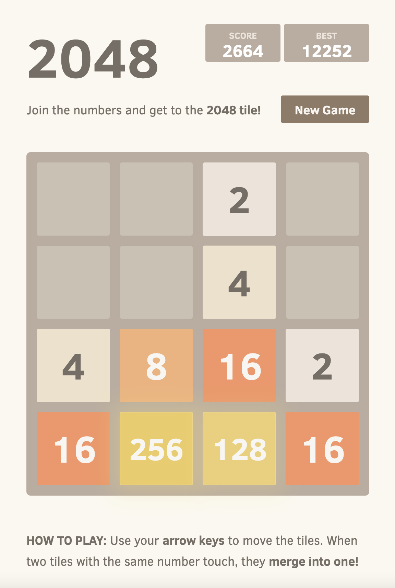

## Description

2048 is played on a plain 4×4 grid, with numbered tiles that slide when a player moves them using the four arrow keys. Every turn, a new tile randomly appears in an empty spot on the board with a value of either 2 or 4. Tiles slide as far as possible in the chosen direction until they are stopped by either another tile or the edge of the grid. If two tiles of the same number collide while moving, they will merge into a tile with the total value of the two tiles that collided. The resulting tile cannot merge with another tile again in the same move. Higher-scoring tiles emit a soft glow

If a move causes three consecutive tiles of the same value to slide together, only the two tiles farthest along the direction of motion will combine. If all four spaces in a row or column are filled with tiles of the same value, a move parallel to that row/column will combine the first two and last two. A scoreboard on the upper-right keeps track of the user's score. The user's score starts at zero, and is increased whenever two tiles combine, by the value of the new tile.

The game is won when a tile with a value of 2048 appears on the board. Players can continue beyond that to reach higher scores. When the player has no legal moves (there are no empty spaces and no adjacent tiles with the same value), the game ends

## Usage

1. Use ArrowLeft, ArrowRight, ArrowUp, ArrowDown to move tile with specific direction.
2. Also you can with a, d, w, s alphabet to move the tile to left, right, up, down
3. The tile with same value will be merged into one tile has the total value of the previous two tiles.
4. You will win when you get the 2048 valu in each tile.

[2048 (click to play)](https://johnyxu.github.io/game2048/index.html)
[](https://johnyxu.github.io/game2048/index.html)

## Docs

We use Scss to write the style of this project, if you want to update the style, you can use the command `node-sass main.scss main.css` to update the style file.
`node-sass` is a command cli with node package manager, you can install it globally by `npm install node-sass -g`


### Application Structure
```
├── style                     # the css style of the game
    ├── main.css
    ├── main.scss             # the style of scss before compiled
    └── ...
├── js                          # game core logic
    ├── main.js                 # the entry file
    ├── GameManager.js          # game loop logic and controller
    ├── KeyboardInputManager.js # monitor the keyboard event
    ├── Grid.js/Tile            # The Tile and Grid class
    ├── LocalstorageManager.js  # save data to local storage
    └── ...
├── screenshots
      └── 2048.png
├── index.html                  # html file

```
### API

Core Class & Method:

- GameManager API
```Javascript
// [GameManager]
// ========
// create the GameManager,
// "size" is the size of the grid,
// "InputManager" monitor the keyboard event and touch event
// "Actuator" update the latest grid updates to game panel
// "StorageManager" manage the state of the game to local storage
new GameManager(size, InputManager, Actuator, StorageManager);

// Restart the game
restart()

// Keep playing after winning (allows going over 2048)
keepPlaying()

// Return true if the game is lost, or has won and the user hasn't kept playing
isGameTerminated()

// Set up the game
setup()

// Set up the initial tiles to start the game with
addStartTiles()

// Adds a tile in a random position
addRandomTile()

// Sends the updated grid to the actuator
actuate()

// Represent the current game as an object
serialize()

// Save all tile positions and remove merger info
prepareTiles()

// Move a tile and its representation
moveTile(tile, cell)

// Move tiles on the grid in the specified direction
move(direction)

// Get the vector representing the chosen direction
getVector(direction)

// Build a list of positions to traverse in the right order
buildTraversals(vector)

// find the farthest position and the next cell which will be merged to
findFarthestPosition(cell, vector)

// check whether the tile have space for moving, generating, merging or not
movesAvailable()

// Check for available matches between tiles (more expensive check)
tileMatchesAvailable()

// check whether two tile position are the same
positionsEqual(first, second)
```


- KeyboardInputManager API
```Javascript
// [InputManager]
// ========
// create the inputManager for keyboard evenet, touch event,
new InputManager()

// register event with related callback function
on(event, callback)

// trigger event with the data for callback
emit(event, data)

// listen to the keyboard event and touch event
listen()

// trigger related event to game manager
restart(event)
keepPlaying(event)

// bind button with click event
bindButtonPress(selector, fn)
```

- LocalStorageManager API
```Javascript
// [LocalStorageManager]
// ========
// create the localstorage manager,
new LocalStorageManager()

// check whether the brower support localstorage or not
localStorageSupported()

// score setter & getter method
setBestScore(score)
getBestScore()

// game state setter & getter & clear method
setGameState(gameState)
getGameState()
clearGameState

```

- HTMLActuator API
```Javascript
// [HTMLActuator]
// ========
// create the actuator for game panel,
new HTMLActuator()

// update the panel display based on the grid & metadata state
actuate(grid, metadata)

// Continues the game (both restart and keep playing)
continueGame()

// remove all the child of the container
clearContainer(container)

// add the tile to the grid with style & postion based on the value & state
addTile(tile)

// get real position of grid with human sense
normalizePosition(position)

// connect the position to get the className of the tile
positionClass(position)

// update the score
updateScore(score)

// update the best score
updateBestScore(bestScore)

// show message
message(won)

// clear the message style
clearMessage()
```

- Grid API
```Javascript
// [Grid]
// ========
// create the grid with tile,
// "size" the number value of the grid
// "previousState"  we can constructor the grid from the previous state
new Grid(size, previousState)

// Build a grid of the specified size
empty()

// build the grid from the previous state
fromState(state)

// Find the first available random position
randomAvailableCell()

// check whether exist empty cell or not in the grid
availableCells()

// Call callback for every cell
eachCell(callback)

// Check if there are any cells available
cellsAvailable()

// Check if the specified cell is taken
cellAvailable(cell)

// the cell is occupied
cellOccupied(cell)

// get the cell with position(x,y)
cellContent(cell)

// Inserts a tile at its position
insertTile(tile)

// remove the tile with position(x,y)
removeTile(tile)

// check valid position
withinBounds(position)

// get serialize data for the grid
serialize()
```

- Tile API
```Javascript
// [Tile]
// ========
// create the tile for grid,
// "position" the position value with object {x: 0, y: 0}
// "value"  the number value of the Tile
new Tile(position, value)

// save the position to previous
savePosition()

// update current position
updatePosition(position)

// serialize the data for tile
serialize()
```
